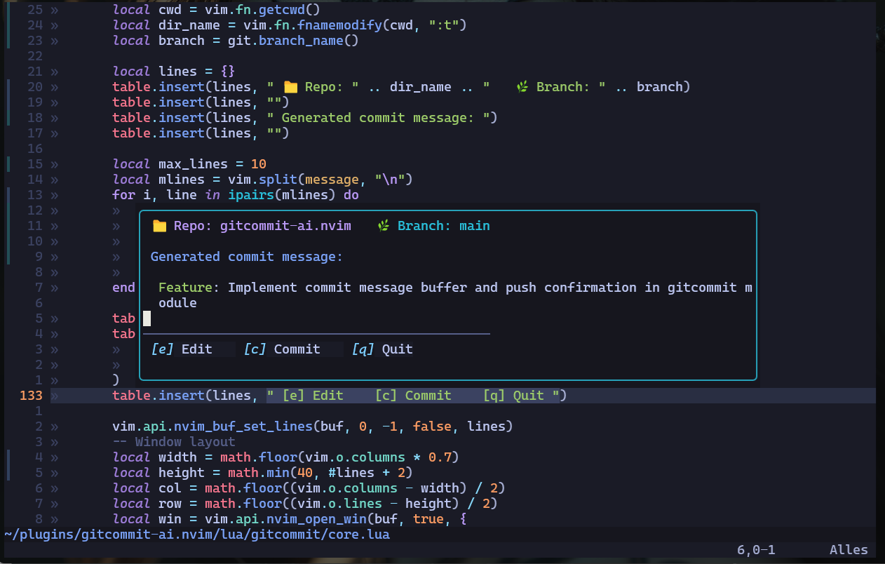

🚀 A Neovim plugin that generates Git commit messages using OpenAI.
# gitcommit-ai.nvim

Save time and write better commit messages with the help of AI. This plugin analyzes your Git diff and generates a clear, consistent, and categorized commit message based on your changes.

---

## ✨ Features

- 🤖 Generates commit messages using OpenAI Chat API (GPT-3.5 / GPT-4 / GPT-4o)
- 🔍 Checks Git status before continuing
- 📄 Opens message in editable buffer (optional edits)
- 💾 Commit on save
- ❌ Cancel with `q`
- 🚀 Asks to push after commit
- 🔥 Default prompt with smart categorization (Feature, Bugfix, Refactor)

---

## 🛠 Installation (Lazy.nvim)

```lua
{
  "robvandersluis/gitcommit-ai.nvim",
  dependencies = { "nvim-lua/plenary.nvim" },
  config = function()
    require("gitcommit").setup({
      
      -- Default Configuration:
      model = "gpt-4o-mini", 
      temperature = 0.7,
      system_prompt = [[
        You are an assistant that only generates git commit messages.
        Use one of the following prefixes:
        - Feature: for new functionality
          - Bugfix: for resolved bugs
          - Refactor: for code changes without functional impact
        Return only the commit message, without any explanation.
      ]],
      user_prompt = "Generate a clear commit message based on this git diff:",
      api_key = os.getenv("OPENAI_API_KEY"),
    })

    vim.keymap.set("n", "<leader>gc", "<cmd>GenerateCommitMessage<CR>", { desc = "AI Commit" })
  end,
}
```

---

## 🔐 Setting your OpenAI API Key

This plugin reads the API key from the `OPENAI_API_KEY` environment variable.

### Linux / macOS (Zsh or Bash)
```bash
echo 'export OPENAI_API_KEY="sk-..."' >> ~/.zshrc
source ~/.zshrc
```

### Windows (PowerShell)
```powershell
notepad $PROFILE
# Add this line:
$env:OPENAI_API_KEY = "sk-..."
. $PROFILE
```

---

## 🚀 Usage

- Run with command: `:GenerateCommitMessage`
- Or use the default keymap: `<leader>gc`

### Workflow:
1. Plugin checks if you're in a valid Git repo with unstaged changes
2. It generates a commit message based on `git diff HEAD`
3. Opens a buffer with the message (you can still edit)
4. Save (`:w`) to commit
5. Press `q` to cancel
6. After commit, you'll be asked if you want to push

---

## ⚙️ Configuration options

```lua
require("gitcommit").setup({
  model = "gpt-4o",
  temperature = 0.7,
  system_prompt = "...",
  user_prompt = "...",
  api_key = "...", -- optional (will default to env var)
})
```

Defaults already work well out-of-the-box.

---

## 🧠 Default prompt logic

The built-in prompt will guide the AI to:
- Detect the type of change (Feature, Bugfix, Refactor)
- Return only the commit message in format: `Feature: ...`
- Skip explanations

---

## 📷 screenshot


---

## ✅ Todo / Ideas

- [x] Working core logic
- [x] Cancel with `q`
- [x] Ask to push
- [ ] Add retry (`:GenerateCommitMessage!`)
- [ ] Add option for `git diff --cached`
- [ ] Highlight AI output (e.g., markdown/comments)
- [ ] `.env` file support (optional)

---

## 🧪 Local Development
```lua
{
  dir = "~/plugins/gitcommit-ai.nvim",
  dependencies = { "nvim-lua/plenary.nvim" },
  config = function()
    require("gitcommit").setup()
  end,
}
```

---

Made with ❤️ and way too much coffee ☕ by [@robvandersluis](https://github.com/robvandersluis)

A Neovim plugin that generates AI-powered Git commit messages using OpenAI.
